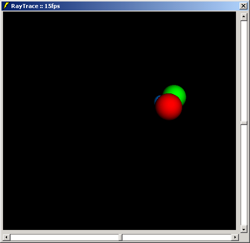

<div align="center">

## Realtime simple raytracer \(updated 30 April 2002\)


</div>

### Description

Updated by Bill Soo... instead of 25 fps, it runs at 60 fps now! Which is an astonishing framerate for VB

Again some pretty unique code from me. This program is a _realtime_ raytracer (not raycaster!). I ported it from C++ to VB, and it still runs pretty fast. It also shows you how to use SetDibbits to change all the bits in a picturebox with just one call. You can zoom in and out, add more spheres by changing a few variables/constants in the code. Light-positions can be set by the scroll bars and changes will be visible directly!

Note: Please compile this program, or you will receive ~1-2 FPS from the IDE.

I would appreciate some votes, people, so that I can still think my (unique) work is appreciated =-)

Update: I've moved some math functions inline, and improved the code wherever it was possible. 10fps more now! Do not forget to compile the program though... Original source is also included. I'd really appreciate if you vote for this code guys.
 
### More Info
 
I assume that you have some knowledge about "what a Raytracer actually is"


<span>             |<span>
---                |---
**Submitted On**   |2002-04-30 10:05:36
**By**             |[Almar Joling](https://github.com/Planet-Source-Code/PSCIndex/blob/master/ByAuthor/almar-joling.md)
**Level**          |Intermediate
**User Rating**    |4.7 (241 globes from 51 users)
**Compatibility**  |VB 6\.0
**Category**       |[Graphics](https://github.com/Planet-Source-Code/PSCIndex/blob/master/ByCategory/graphics__1-46.md)
**World**          |[Visual Basic](https://github.com/Planet-Source-Code/PSCIndex/blob/master/ByWorld/visual-basic.md)
**Archive File**   |[Realtime\_s775124302002\.zip](https://github.com/Planet-Source-Code/almar-joling-realtime-simple-raytracer-updated-30-april-2002__1-32216/archive/master.zip)

### API Declarations

```
Private Declare Function GetTickCount Lib "kernel32" () As Long
Private Declare Function SetDIBits Lib "gdi32" (ByVal hdc As Long, ByVal hBitmap As Long, ByVal nStartScan As Long, ByVal nNumScans As Long, lpBits As Any, lpBI As BITMAPINFO, ByVal wUsage As Long) As Long
```


